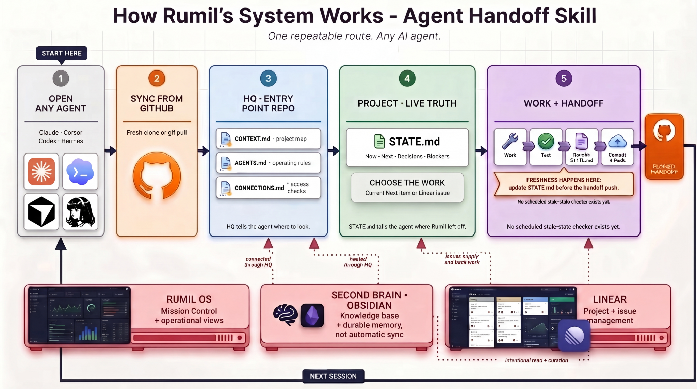

# Agent Handoff Skill

**Persistent project context across AI agents.** Every AI session starts with
amnesia. The fix isn't a smarter agent — it's a system: a map repo, a
`STATE.md` in every project, and GitHub as the glue. Any agent on any machine
picks up where the last one left off.



Everyone else's memory setup is locked to one tool — a vault, a plugin, a
prompt. This system asks one thing of an agent: **can it read and write a git
repo.** Tools churn; the memory stays. (To be precise: this is persistent
*project context*, not automatic model memory — it works because agents read
and write these files every session, and the skills make that non-optional.)

## What's in the box

| Piece | What it does |
|---|---|
| [`agent-handoff-setup/`](agent-handoff-setup/) | One-time guided setup: interviews you, then scaffolds your HQ repo (CONTEXT.md, AGENTS.md, CONNECTIONS.md) and a STATE.md in each project |
| [`agent-handoff/`](agent-handoff/) | The daily loop: read → work → update → test → push. Starts every session where you left off; ends every session with a rewritten STATE.md |
| [`agent-handoff-setup/templates/`](agent-handoff-setup/templates/) | The durable payload — five markdown templates that work with ANY agent, no skills required |

## Quickstart (Claude Code)

```bash
git clone https://github.com/Rlegaspi562/agent-handoff-skill
cp -r agent-handoff-skill/agent-handoff-setup agent-handoff-skill/agent-handoff ~/.claude/skills/
```

Then in Claude Code: *"Set up my agent handoff system."* The setup skill
interviews you and builds everything. From then on, start sessions with
*"where did I leave off?"* and end them with *"handoff"*.

## Not using Claude? Good — that's the point

The skills are conveniences; the files are the system. Grab the
[templates](agent-handoff-setup/templates/), fill them in, push them, and add
this to any agent that can read your GitHub:

> Before anything: read `<your-hq-repo>` — CONTEXT.md first, then AGENTS.md,
> then read STATE.md of the project I name. Then tell me where I left off.
> When we finish, rewrite that STATE.md, commit it as "state: one-liner",
> and push.

Cursor rules, Codex AGENTS.md, and CLAUDE.md one-liners are in
[`PROMPT.template.md`](agent-handoff-setup/templates/PROMPT.template.md).

## The rules that make it work

1. **The map never lies about the territory.** HQ holds stable facts only;
   live status lives in each project's STATE.md.
2. **Updating STATE.md is definition-of-done**, not a favor. Any session that
   changes code, makes a decision, or hits a blocker rewrites the file in the
   same commit batch.
3. **Rewrite, don't append.** STATE.md targets 2KB. It's a living handoff,
   not a changelog.
4. **Record why, not what.** "Chose X over Y because Z" saves the next agent
   from re-architecting; "tried A, failed because B" saves it from dead ends.

## Start small

One `STATE.md` in one repo. Make updating it definition-of-done. Add the HQ
map when you have a second project. That's it — no database, no vendor,
no API.

---

MIT licensed. Built by [Rumil Legaspi](https://github.com/Rlegaspi562).
