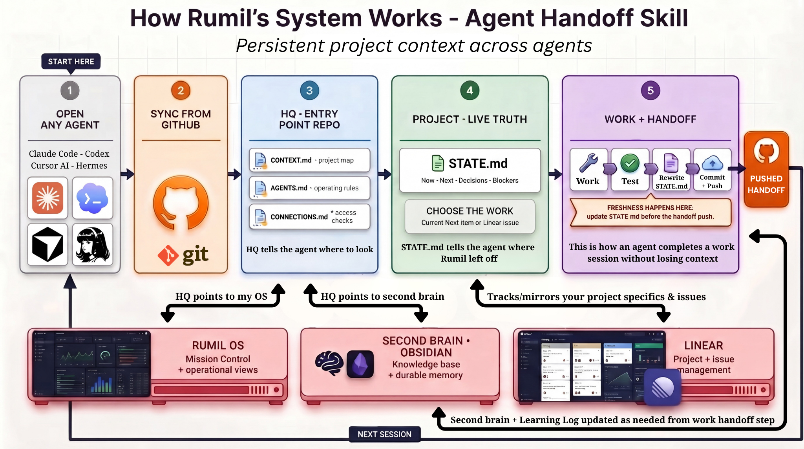

# Agent Handoff Skill

AI sessions do not share dependable project context by default. This project
stores that context in plain Markdown files:

- An HQ repository lists your projects, machines, and shared instructions.
- Each project has a `STATE.md` with current work, next actions, and decisions.
- Git carries the latest pushed handoff between machines and agents.

An agent can continue from the handoff when it has repository access and reads
the files. This is persistent project context, not automatic model memory.



## What's included

| Piece | What it does |
|---|---|
| [`agent-handoff-setup/`](agent-handoff-setup/) | Asks setup questions, then creates the HQ files and a `STATE.md` for each project |
| [`agent-handoff/`](agent-handoff/) | Provides the daily read, work, checks, state update, handoff verification, and push instructions |
| [`agent-handoff-setup/templates/`](agent-handoff-setup/templates/) | Contains five Markdown templates that can be used without installing the skills |
| [`anti-ai-slop/`](anti-ai-slop/) | Audits and rewrites prose to remove AI-sounding language while protecting technical accuracy |

## Quickstart (Claude Code)

```bash
git clone https://github.com/Rlegaspi562/agent-handoff-skill
cp -r agent-handoff-skill/agent-handoff-setup agent-handoff-skill/agent-handoff agent-handoff-skill/anti-ai-slop ~/.claude/skills/
```

Then in Claude Code: *"Set up my agent handoff system."* The setup skill
asks for the required project details and creates the initial files. In later
sessions, use *"where did I leave off?"* to read the handoff and *"handoff"* to
update it.

## Using another agent

The files do not require Claude Code. Copy the
[templates](agent-handoff-setup/templates/), fill them in, and push them to a
Git remote. Then give this instruction to an agent with repository access:

> First, read `<your-hq-repo>`. Read `CONTEXT.md`, then `AGENTS.md`, followed
> by the named project's `STATE.md`. Tell me where the project stopped. At the
> end, update `STATE.md` if the session changed code, blockers, decisions, or
> next actions, or stops waiting on my input. If you can edit the checkout,
> commit it as `state: <one-liner>`. If the remote allows writes, push it.

Optional reminders for Cursor, Codex, and Claude Code are in
[`PROMPT.template.md`](agent-handoff-setup/templates/PROMPT.template.md).

## Operating rules

1. Keep current project status in each project's `STATE.md`, not in HQ.
2. Update `STATE.md` when work changes code, decisions, blockers, or next
   actions.
3. Replace stale information instead of appending a history. Keep the file
   near 2 KB.
4. Record decisions, rationale, and failed approaches that affect future work.
5. Commit and push the handoff when Git write access is available.

## Start small

Start with one `STATE.md` in one repository. Add an HQ repository when you
need to track more than one project. The file-based setup does not require a
database or a separate API.

MIT licensed. Built by [Rumil Legaspi](https://github.com/Rlegaspi562).
